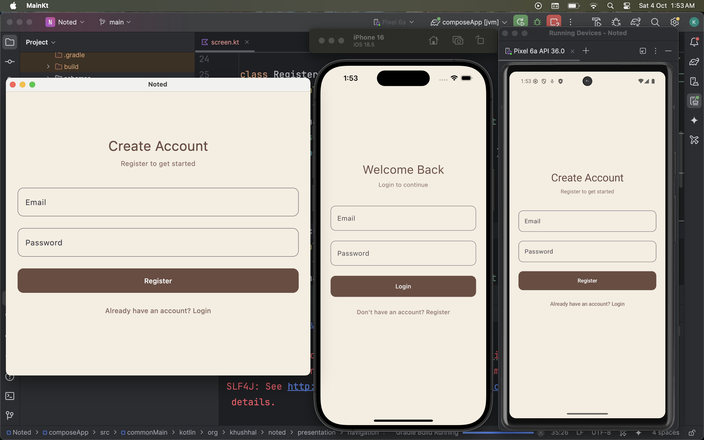
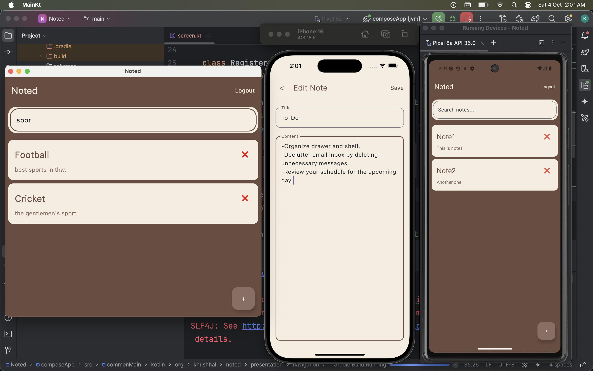

# 📝 KMP Notes App

A **cross-platform Notes application** built using **Kotlin Multiplatform (KMP)** that works on **Android, iOS, and Desktop**.  
It follows **MVVM + Clean Architecture** and is implemented entirely in **Kotlin with Jetpack Compose**.

This project demonstrates **modern cross-platform app development**, secure user authentication, and clean separation of business logic from UI.

---

## 🚀 Features
- 🔐 **User Authentication** – Register, Login, Logout
- 💾 **Local Storage** – Remembers passwords for auto-login (no full offline sync yet)
- 🖥️ **Cross-Platform** – Single Kotlin codebase for Android, iOS, and Desktop
- 📱 **Modern UI** – Jetpack Compose across all platforms
- 🗂️ **MVVM + Clean Architecture** – Organized, scalable code structure
- ☁️ **Network Integration** – Consumes REST API from Flask backend
- 🧩 **Dependency Injection** – Managed using **Koin**

---

## ⚡ Operations

The app supports the following core operations:

### 🔐 Authentication
- **Register** – Users can create an account with email & password
- **Login** – Authenticate using registered credentials
- **Auto-login** – Local storage remembers passwords to skip login
- **Logout** – Clears session and local password storage

### 📝 Notes Management (CRUD)
- **Create** – Users can add new notes (title + content)
- **Read** – Users can view a list of their own notes
- **Update** – Users can edit title or content of their notes
- **Delete** – Users can remove notes permanently

### 🔒 Data Privacy
- Each user can **only access their own notes**
- Backend uses **JWT-based authentication** to ensure secure API calls

---

## 📸 Screenshots

### 🔑 Login Screen
  

### 📝 Notes Screen
  

---

## 🛠️ Tech Stack

### Core
- **Kotlin Multiplatform (KMP)** – Shared business logic for Android, iOS, Desktop
- **Jetpack Compose** – UI layer across platforms
- **Coroutines + Flow** – Asynchronous operations

### Networking
- **Ktor** – Client for REST API integration

### Dependency Injection
- **Koin** – Core + Compose + ViewModel modules

### Database & Local Storage
- **Room / SQLDelight** – Local database for notes & password storage
- **SQLite** – Bundled DB support

### Libraries & Utilities
- **Kotlinx-Datetime** – Date & time handling
- **Voyager** – Navigation & screen management
- **Kotlin Serialization** – JSON parsing
- **KSP** – Annotation processing